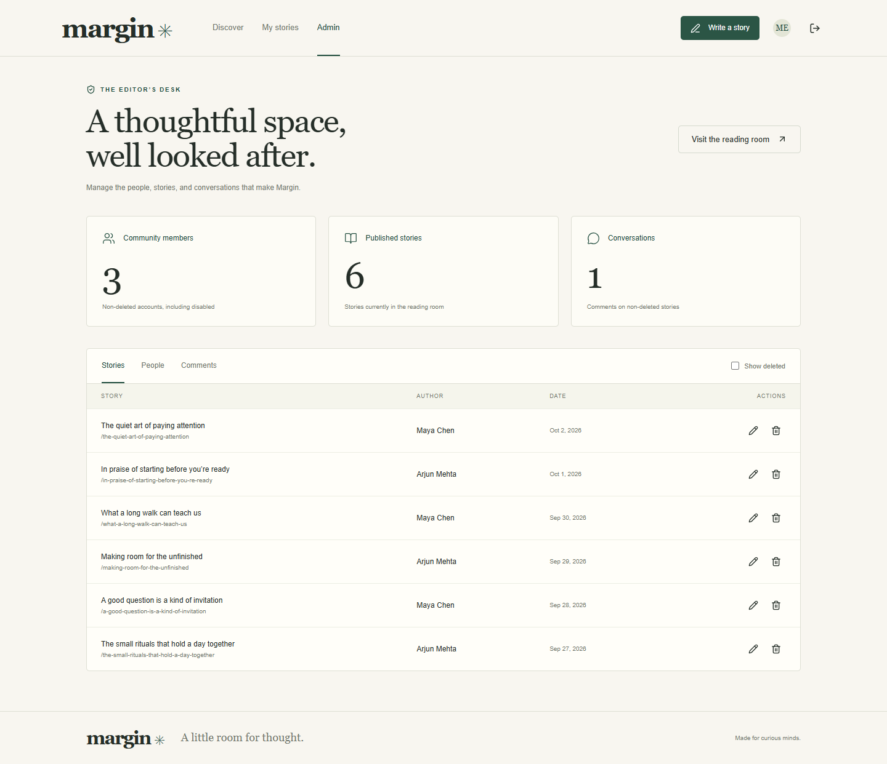

# Margin ✳

**A little room for thought.**

Margin is a complete local MERN blog application for publishing stories and having thoughtful conversations. It includes email/password authentication, rotating JWT sessions, Google/Facebook OAuth integration, author-owned content, and a dedicated moderation dashboard.

Built for the Tech Exactly MERN Stack Assignment. The name comes from the space around a page: room for ideas, notes, and another person's perspective.


<details><summary>See the admin panel</summary>



</details>

## What is included

- A responsive React reading room, story pages, writing editor, and My Stories.
- Registration, login, logout, bcrypt password hashing, and rate-limited authentication.
- Short-lived JWT access tokens and rotating JWT refresh tokens with replay detection.
- Google OAuth (authorization code + PKCE) and Facebook OAuth through Passport strategies.
- API-level authentication, admin RBAC, and resource ownership checks.
- Validated post/comment CRUD, stable unique slugs, and soft-deleted posts.
- Admin user roles, disable/reactivate/delete actions, post/comment moderation, and live database totals.
- Modular Express routes, controllers, services, Mongoose models, validation, errors, and activity logging.
- Indexed, paginated queries and selective author population.
- Backend tests, frontend tests, and desktop/mobile browser journeys.
- Original sample essays and a repeatable seed command that preserves existing records.

**External setup still required:** real Google and Facebook sign-in require your developer applications and credentials. Without them, the email-based app is fully usable and the social buttons are unavailable. Real provider login has not been verified without those credentials. Socket notifications are an optional assignment bonus and are not included. The final demo video has not been recorded.

## Stack

| Layer          | Technology                                                       |
| -------------- | ---------------------------------------------------------------- |
| Client         | React 19, React Router 7, Vite 7, Context API, Lucide icons, CSS |
| API            | Node.js 24, Express 5, Zod, Helmet, express-rate-limit           |
| Data           | MongoDB with Mongoose 8                                          |
| Authentication | bcryptjs, jsonwebtoken, Passport Google/Facebook strategies      |
| Tests          | Jest, Supertest, Vitest, React Testing Library, Playwright       |
| Tooling        | npm workspaces, ESLint, Prettier, GitHub Actions workflow        |

The lockfile records the exact dependency versions. Font styling uses Google Fonts with local serif/sans-serif fallbacks; application functionality does not depend on font downloads.

## Local requirements

- Node.js **24 LTS**, npm, Git, and a current Chrome or Edge browser.
- MongoDB Community Server **or** the included `npm run db` local runner. Choose one, not both on port 27017.
- Internet for initial dependency/database downloads and real social sign-in.
- Optional: VS Code, MongoDB Compass, Postman. Docker is not required.

The convenience database runner uses a pinned MongoDB **7.0.14** binary for reproducible local development/tests. It is not a production database installer. For a deployed system, provision a maintained MongoDB release and configure the URI. The runner stores persistent development data in `.local/data`; automated tests use separate disposable databases.

## Quick start — Windows PowerShell

Run from the repository root:

```powershell
npm.cmd ci
npm.cmd run setup
```

`setup` creates a private `.env` with random signing secrets and seed passwords. It never overwrites an existing `.env`. Review `.env.example` for available settings.

**Terminal 1 — database** (skip if your MongoDB service already runs on port 27017):

```powershell
npm.cmd run db
```

The first run downloads the MongoDB archive (approximately 592 MB on Windows). Wait for `Margin local MongoDB` and leave the terminal running. Data persists between restarts. This starts a real MongoDB process, not a mock database.

**Terminal 2 — sample data and application:**

```powershell
npm.cmd run seed
npm.cmd run dev
```

Open **http://localhost:5173**. The API is at **http://localhost:5000/api/v1**.

On macOS/Linux, use `npm` instead of `npm.cmd`. For platforms incompatible with the pinned convenience binary, use a native MongoDB installation for development and configure a compatible binary for the test runners.

### Local accounts

| Account       | Email                                                 | Password                  |
| ------------- | ----------------------------------------------------- | ------------------------- |
| Admin         | `.env` → `ADMIN_EMAIL` (default `admin@margin.local`) | `.env` → `ADMIN_PASSWORD` |
| Sample writer | `maya@margin.local`                                   | `.env` → `DEMO_PASSWORD`  |
| Second writer | `arjun@margin.local`                                  | `.env` → `DEMO_PASSWORD`  |

You can also register your own account. Public registration always creates a regular user. The seed command does not reset passwords or promote an existing account; changing seed variables after seeding does not change an existing user's credentials.

Stop the application/database terminals with **Ctrl+C**. Do not delete `.local/data` unless you intentionally want to remove the development database.

## Commands

| Command                 | Purpose                                                     |
| ----------------------- | ----------------------------------------------------------- |
| `npm run setup`         | Generate `.env` if missing                                  |
| `npm run db`            | Start persistent development MongoDB                        |
| `npm run seed`          | Create admin, sample writers, stories and a comment         |
| `npm run dev`           | Start API watcher and Vite together                         |
| `npm run lint`          | Static code checks                                          |
| `npm run format`        | Format source and documentation                             |
| `npm run format:check`  | Verify formatting                                           |
| `npm test`              | Backend and frontend tests                                  |
| `npm run test:coverage` | Tests with coverage reports                                 |
| `npm run build`         | Compile the frontend to `client/dist`                       |
| `npm start`             | Serve API and an existing frontend build on port 5000       |
| `npm run test:e2e`      | Browser tests against an isolated app/database on port 5100 |

For a local single-server preview, build first, set `FRONTEND_URL=http://localhost:5000` in `.env`, then run `npm start`. Keep `NODE_ENV=development` for plain HTTP localhost. Restore `FRONTEND_URL=http://localhost:5173` before returning to Vite. OAuth callback URLs must match whichever origin you use.

## Environment

All secrets belong in the root `.env`, which is ignored by Git. No secret is placed in a `VITE_` variable or returned by the API.

| Key                                                                     | Meaning                                                                  |
| ----------------------------------------------------------------------- | ------------------------------------------------------------------------ |
| `NODE_ENV`                                                              | `development`, `test`, or `production`                                   |
| `PORT`                                                                  | API port, default 5000                                                   |
| `FRONTEND_URL`                                                          | Exact trusted browser origin; local Vite default `http://localhost:5173` |
| `MONGODB_URI`                                                           | Development database URI; default database `margin_dev`                  |
| `JWT_SECRET`                                                            | At least 32 characters; signs JWTs                                       |
| `COOKIE_SECRET`                                                         | Separate secret; signs OAuth browser-binding cookies                     |
| `ADMIN_EMAIL`, `ADMIN_PASSWORD`, `ADMIN_NAME`                           | Initial admin seed inputs                                                |
| `DEMO_PASSWORD`                                                         | Initial password for both sample writers                                 |
| `GOOGLE_CLIENT_ID`, `GOOGLE_CLIENT_SECRET`, `GOOGLE_CALLBACK_URL`       | Google OAuth web client settings                                         |
| `FACEBOOK_CLIENT_ID`, `FACEBOOK_CLIENT_SECRET`, `FACEBOOK_CALLBACK_URL` | Facebook OAuth application settings                                      |

See [OAuth setup](docs/OAUTH_SETUP.md) for provider configuration. Restart the API after changing `.env`.

## Architecture

```text
Browser / React
    → /api/v1 (proxied by Vite during development)
    → Express Router
    → Authentication + role/ownership + validation middleware
    → Controller (HTTP boundary)
    → Service (business rules)
    → Mongoose model
    → MongoDB
```

```text
client/src/
  api/             HTTP requests, token refresh and session notifications
  components/      Shared layout, status displays, dialogs and editorial artwork
  context/         Global authentication state
  hooks/           Resource loading with stale-response protection
  pages/           Feed, login/register, story, editor and admin screens
  test/            Component, auth, request-client and regression tests
server/src/
  config/          Environment, database, OAuth strategies/state store
  controllers/     Request/response handling
  middleware/      JWT auth, RBAC, CSRF/origin checks, rate limits, logs, errors
  models/          Mongoose schemas and indexes
  routes/          Versioned Express route groups
  services/        Accounts/sessions, content and administration
  utils/           Safe serializers, errors and pagination responses
  validators/      Zod request contracts
server/tests/      Isolated backend unit/integration tests
server/scripts/    Non-destructive demo seed
scripts/          Environment setup, local database, isolated browser-test server
e2e/              Desktop and mobile browser journeys
docs/             API reference, OAuth setup, demo and verification notes
```

### Data and permissions

- `User`: name, optional unique email, hidden password hash, role, status, timestamps, deletion marker.
- `OAuthIdentity`: unique provider/user-ID pair referencing a user. Never auto-links by matching email.
- `AuthSession`: hashed refresh token, user, expiry and revocation marker.
- `Post`: title, content, unique stable slug, author, timestamps and `deletedAt`.
- `Comment`: content, author and post references, timestamps.
- `ActivityLog`: actor, action, target, HTTP outcome, request ID and timestamps. No raw credentials.
- `OAuthState`: expiring, single-use state with browser binding and optional PKCE verifier.
- `AdminLock`: serializes admin membership changes across API processes; concurrent mutations can return 409 and be retried.

Visitors read non-deleted posts/comments. Users write posts/comments and modify only their own. Admins moderate all content and manage accounts. The backend looks up current roles/status and checks active sessions rather than trusting a role supplied by the browser.

Post deletion retains its MongoDB record. Its comments are retained but hidden on public endpoints. Comment deletion is permanent. Deleted accounts cannot log in, and their retained content displays `Deleted account`. Disabled accounts keep their author name but lose access. Deleted users' email addresses remain reserved.

Dashboard totals count non-deleted users (including disabled), non-deleted posts, and comments attached to non-deleted posts. Admin comment moderation includes retained comments on deleted posts, so its list can be larger than the dashboard count.

### Session and security choices

- Access JWT: 15 minutes, held in browser memory rather than localStorage.
- Refresh JWT: 7 days with sliding rotation, delivered only via an HttpOnly, SameSite=Lax cookie; Secure in production.
- Refresh tokens are hashed in MongoDB. Atomic rotation prevents successful double-use; replay revokes that session.
- Logout revokes the current session; account management revokes all affected sessions. Access checks validate revocation on every protected request.
- Same-origin API calls, an origin allowlist and a required custom header for cookie-bearing mutations protect browser state-changing requests. No wildcard CORS.
- Authentication is rate limited. OAuth state is one-use, expiring, and bound to the initiating browser.
- User text renders as plain text; HTML is not injected into the DOM.
- Strict input schemas reject unexpected role/author fields. Public responses never expose password hashes, session records, or author emails.
- Logs are structured and omit request bodies/cookies. Audit writes are best-effort, not a compliance-grade audit system.

Local servers bind to loopback. A production deployment would additionally need HTTPS, a deliberate reverse-proxy/trust-proxy configuration, a shared rate-limit store when scaling to multiple instances, secret management, database backups, and operational monitoring. The local workflow does not deploy anything.

## API

All routes start with `/api/v1`. Full endpoint/response documentation is in [docs/API.md](docs/API.md).

| Group           | Main operations                                                                           |
| --------------- | ----------------------------------------------------------------------------------------- |
| `/auth`         | Register, login, refresh, logout, current user, provider availability and OAuth redirects |
| `/posts`        | Public list/detail, owner create/update/delete, nested comments                           |
| `/comments/:id` | Owner/admin update/delete                                                                 |
| `/admin`        | Stats, users, all active/deleted posts, all comments                                      |

Success: `{ "data": ... }`. Failure: `{ "error": { "code", "message", "requestId" } }`. Rate-limit responses omit requestId but still carry the `X-Request-Id` response header. Pagination uses `page` and `limit` with a maximum page size of 50.

## Testing

```powershell
npm.cmd run lint
npm.cmd run test:coverage
npm.cmd run build
npm.cmd run test:e2e
```

Backend tests launch a disposable real MongoDB instance named `margin_test`. Browser tests launch another isolated database named `margin_e2e`, seed test-only accounts, and serve the built app on port 5100. Neither suite modifies `margin_dev` or uses real OAuth credentials.

The default browser channel is **Microsoft Edge** for this Windows workspace. To use downloaded Chromium:

```powershell
npx.cmd playwright install chromium
$env:PLAYWRIGHT_CHANNEL = 'chromium'
npm.cmd run test:e2e
```

Set `PLAYWRIGHT_CHANNEL=chrome` to use an installed Chrome. Mobile tests emulate an iPhone-sized viewport in Chromium; they are not tests on a physical iPhone or Safari.

Backend coverage gates require 80% statements and 80% branches in services, middleware, validators and response utilities. Browser tests verify complete journeys; real OAuth provider success requires the separate manual checklist in `docs/OAUTH_SETUP.md`.

Reports: `server/coverage/`, `client/coverage/`, `playwright-report/`, and failure screenshots/traces in `test-results/`. These generated files are ignored by Git. See [verification notes](docs/TESTING.md) for the latest executed results and limitations.

## Assignment delivery

- Source and documentation are local, ready for review in the existing Git repository.
- GitHub remote: `https://github.com/Sandhit06/MERN-Stack-Assignment--Tech-Exactly`.
- No push or deployment has been performed.
- [Demo script](docs/DEMO.md) provides a 5–10 minute walkthrough.
- [Original implementation plan](PROJECT_PLAN.md) records the design decisions before coding.

## Troubleshooting

| Symptom                                    | What to check                                                                 |
| ------------------------------------------ | ----------------------------------------------------------------------------- |
| `Invalid environment`                      | Run `npm run setup`; verify named keys in `.env`                              |
| MongoDB connection refused                 | Start `npm run db` or your MongoDB service; check URI/port                    |
| Port 27017 already occupied                | Use the existing MongoDB service; do not run a second database on that port   |
| Port 5000/5173 occupied                    | Stop an earlier Margin process before starting another                        |
| API unavailable in the page                | Confirm API terminal is running and Vite proxy points to port 5000            |
| Sign-in fails after changing seed password | Seed preserves existing accounts; the previous password still applies         |
| OAuth button disabled                      | Fill all three settings for that provider, then restart API                   |
| OAuth redirect mismatch                    | Match scheme, host, port, and path exactly in app settings and `.env`         |
| Requests rejected by origin checks         | Use `localhost`, not `127.0.0.1`, in the browser; match `FRONTEND_URL`        |
| Tests cannot find Edge                     | Install test Chromium and set `PLAYWRIGHT_CHANNEL=chromium`                   |
| Database download fails                    | Check network/proxy access to `fastdl.mongodb.org`; do not disable TLS checks |
| PowerShell refuses `npm.ps1`               | Use `npm.cmd` / `npx.cmd` as shown above                                      |

### Reference documentation

[React](https://react.dev/) · [Express](https://expressjs.com/) · [Mongoose](https://mongoosejs.com/docs/) · [Google OAuth](https://developers.google.com/identity/protocols/oauth2/web-server) · [Passport Google](https://www.passportjs.org/packages/passport-google-oauth20/) · [Passport Facebook](https://www.passportjs.org/packages/passport-facebook/) · [Playwright](https://playwright.dev/docs/intro)


## Still need help?
Open an issue on our GitHub repository, and we will help you as soon as possible.

Enjoy exploring and extending this project! Feel free to contribute and suggest improvements.

## Contact

If you want to contact me you can reach me at [Twitter](https://x.com/SandhitK).

## Developer
<table>
    <tr align="center">
        <td>
        Sandhit Karmakar
        <p align="center">
            
        </p>
            <p align="center">
                <a href="https://github.com/Sandhit06">
                    
                </a>
                <a href="https://www.linkedin.com/in/sandhit-karmakar/" target="_blank">
                    
                </a>
                <a href="mailto:sandhitkarmakar@gmail.com" target="_blank">
                    
                </a>
            </p>
        </td>
    </tr>
</table>

<p align="center">
    Made with ❤️ by <a href="https://github.com/Sandhit06">Sandhit Karmakar</a>
</p>
